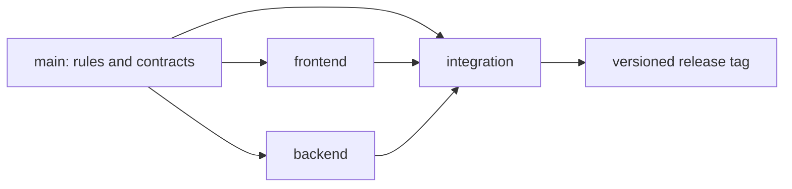

# Collaboration Foundation

This repository starts as a technology-neutral governance foundation for a
product built by separate frontend and backend teams. The permanent `main`
branch defines how the product is built; the permanent `frontend` and
`backend` branches contain stack implementation; `integration` is the only
place where the complete product is assembled and released.

There is no product implementation yet.

## Start here

Read these documents in order before contributing:

1. [Repository rules](RULES.md)
2. [Contribution workflow](CONTRIBUTING.md)
3. [Branch and release workflow](docs/WORKFLOW.md)
4. [Contract policy](docs/CONTRACTS.md)
5. [Quality gates](docs/QUALITY.md)
6. [Handoff protocol](HANDOFF.md)

Automated contributors must also follow [AGENTS.md](AGENTS.md).

## Permanent branches

| Branch | Purpose | Product paths allowed |
| --- | --- | --- |
| `main` | Rules, specifications, contracts, and governance automation | None |
| `frontend` | Frontend implementation and frontend-local documentation | `frontend/` |
| `backend` | Backend implementation and backend-local documentation | `backend/` |
| `integration` | End-to-end tests, deployment composition, and integration-only tooling | `integration/` |

The `integration` branch also receives the committed contents of `frontend/`
and `backend/` through reviewed merge commits. It is the only branch expected
to contain the complete runnable product.

## Repository map

| Path | Purpose |
| --- | --- |
| `contracts/` | Approved machine-readable interfaces and their aggregate version |
| `docs/` | Architecture, workflow, ownership, quality, and reusable templates |
| `.github/` | Review ownership, issue forms, PR template, and policy checks |
| `scripts/` | Cross-platform governance validation |

## Delivery flow



Cross-stack behavior is specified and approved on `main` first. Each stack is
then implemented independently against the same contract. Approved stack
changes are merged continuously into `integration`, where end-to-end checks
decide whether a release may be tagged.

## Local validation

On Windows PowerShell:

```powershell
powershell -NoProfile -ExecutionPolicy Bypass -File scripts/Test-Policy.Tests.ps1
powershell -NoProfile -ExecutionPolicy Bypass -File scripts/Test-Foundation.ps1
```

On PowerShell 7:

```powershell
pwsh -NoProfile -File scripts/Test-Policy.Tests.ps1
pwsh -NoProfile -File scripts/Test-Foundation.ps1
```

Before connecting GitHub, replace the ownership placeholders in
[ownership documentation](docs/OWNERSHIP.md) and `.github/CODEOWNERS`, fill in
the [project brief](docs/PROJECT_BRIEF.md), and follow the
[GitHub setup guide](docs/GITHUB_SETUP.md).

