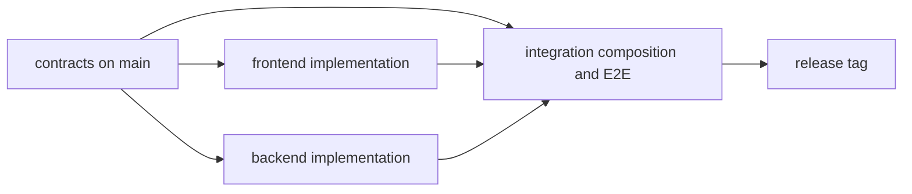

# Architecture

This document defines stable system boundaries. Replace the clearly marked
project placeholders when the first product is selected; record consequential
choices as ADRs rather than silently rewriting history.

## Repository-level architecture

| Boundary | Owns | Must not own |
| --- | --- | --- |
| Governance | Product intent, rules, shared contracts, decisions | Product implementation |
| Frontend | User experience, client state, presentation, client contract adapters | Backend implementation or private server behavior |
| Backend | Domain behavior, persistence, authorization enforcement, service contract implementation | Frontend implementation or presentation behavior |
| Integration | Composition, environments, cross-stack fixtures, end-to-end tests, release validation | Canonical stack implementation |

Frontend and backend MUST depend on approved contracts, not on each other's
source trees. Integration consumes both outputs and supplies only the glue
needed to run and validate them together.

## Product context

- **Product:** `[name]`
- **Problem:** `[problem being solved]`
- **Primary users:** `[audiences]`
- **External systems:** `[systems or none]`
- **Deployment environments:** `[environments]`
- **Availability and performance targets:** `[targets]`
- **Regulatory or data constraints:** `[constraints or none]`

The detailed intent belongs in [PROJECT_BRIEF.md](PROJECT_BRIEF.md).

## Runtime components

Complete this table before the first implementation issue is ready.

| Component | Responsibility | Owner | Inputs | Outputs | Runtime |
| --- | --- | --- | --- | --- | --- |
| Frontend | Next.js App Router UI; server code limited to a BFF proxy ([ADR-0001](decisions/0001-frontend-stack-nextjs.md)) | Frontend owner | Approved contract | User interactions | Node.js / Next.js |
| Backend | `[responsibility]` | Backend owner | Approved requests/events | Approved responses/events | `[runtime]` |
| Data store | `[responsibility]` | Backend owner | Domain operations | Durable data | `[technology]` |
| Integration | Compose and verify the product | Integrator | Stack artifacts | Release evidence | `[runtime]` |

## Data and trust boundaries

Before production work begins, document:

- data classifications and retention requirements;
- authentication and authorization boundaries;
- encryption requirements in transit and at rest;
- third-party data transfers;
- audit events and sensitive log fields; and
- backup, restoration, and deletion ownership.

Secrets are injected by the deployment environment. They are never stored in
contracts, source, fixtures, logs, screenshots, issues, or handoffs.

## Architecture invariants

- Shared behavior has one approved contract under `contracts/`.
- The backend enforces domain and authorization rules; client checks are not a
  security boundary.
- Server code under `frontend/` is a backend-for-frontend proxy. It never
  implements domain rules, decides authorization, or opens a data connection
  ([ADR-0001](decisions/0001-frontend-stack-nextjs.md)).
- Each stack can be built and tested without copying source from the other.
- Integration tests exercise published interfaces, not private implementation.
- Deployment and rollback procedures are reproducible from an immutable
  `integration` tag.
- A decision that changes a boundary, data model, trust model, public contract,
  or deployment shape requires an ADR.

